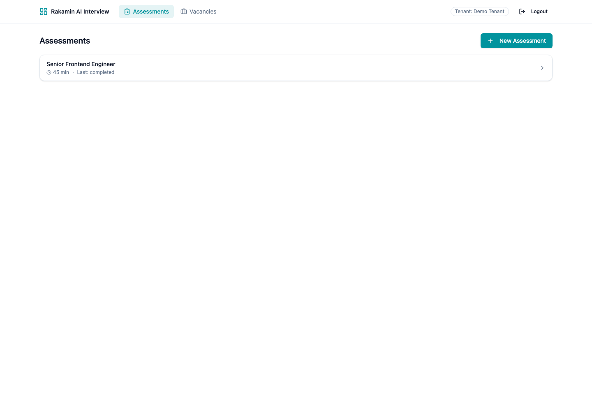
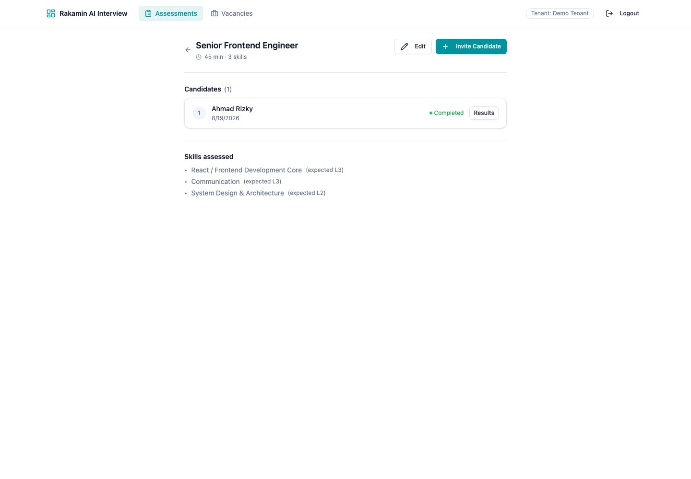
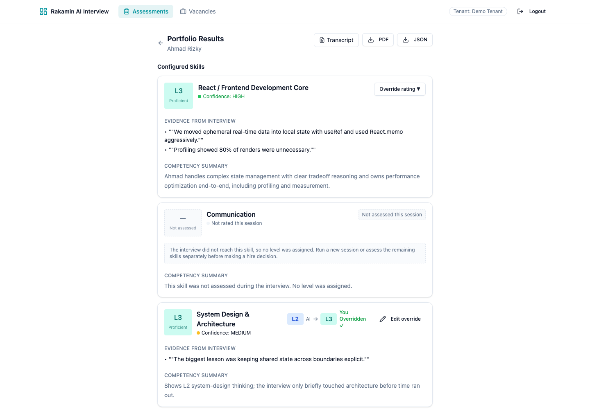
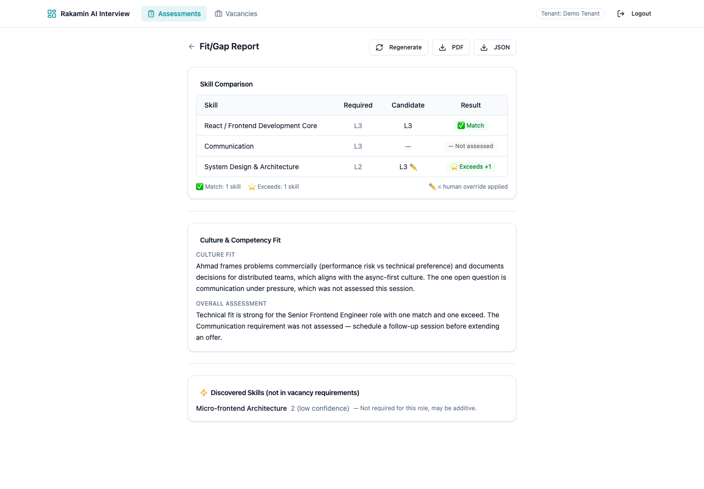
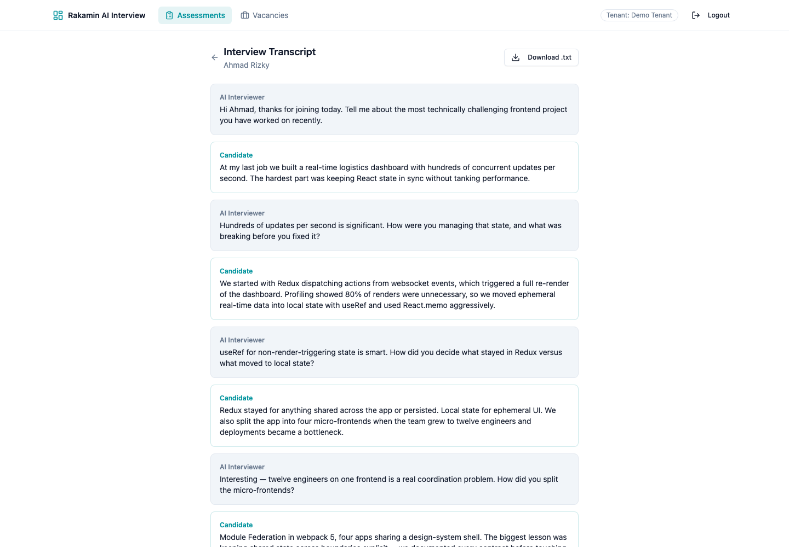

# AI Interview Platform — Fullstack Product Engineering Case Study

**Candidate:** Agus Setyawan
**Submission date:** 19 August 2026
**Engineering depth claim:** Backend-heavy (data integrity + service logic), with a supporting frontend module (honest unassessed states + corrected fit/gap rendering).

**PR link:** https://github.com/rakamindev/ai-interview-platform/pull/63

---

## 1. Execution Journey (Step-by-Step Narrative)

### 1.1 Setup & Local Exploration (Step 1)

- Cloned the repository and read the brief, the wiki PRD 01 (First Principles: AI Interview Behavior) and PRD 02 (End-to-End Interview simulation) carefully.
- Ran both services locally: Rails API (`api/`, Ruby on Rails 7 + PostgreSQL + Sidekiq) on `:3001`, React web app (`web/`, React 18 + TypeScript + Vite + Tailwind) on `:5173`.
- Installed toolchain (Ruby 3.3, PostgreSQL 16, Redis), created/migrated/seeded the DB, minted a dev JWT, and exercised the API via curl before touching code.
- Confirmed the baseline claims in the brief: **RSpec has zero specs**, the **web app has no test runner**, and there is **no CI**.

### 1.2 Deep Context & Domain Immersion (Step 2)

Mapped the five pillars of the brief onto what the code actually does:

| Pillar | What I found |
|---|---|
| **The product** | A live audio interview where Gemini (Live) interviews a candidate against an assessment agenda, a coverage analyzer (Flash) tracks probe depth per skill, and a portfolio generator (Pro) turns the transcript into a per-skill level + confidence report. Assessors review, override, compare against vacancies (fit/gap), and export PDF/JSON. |
| **The industry** | Hiring/talent assessment in Indonesia is high-stakes and noisy. Commoditized parts (ATS, JD scraping) are everywhere; the *leverage* is defensible evidence behind a rating. A wrong rating "changes a real person's year". UU PDP (Law 27/2022) makes candidate PII handling a legal duty, not a nicety. |
| **What it is for** | Produce an *evidence-backed skill portfolio* an assessor can trust, then act on (fit/gap + override). It only stays useful if every number in the report is traceable to transcript quotes. |
| **The users** | Assessors/recruiters: fast, correct, defensible results; they already distrust black-box scores. |
| **The candidates** | Do not opt in, cannot opt out, and a wrong result changes their year. **Design principle I adopted: never display a fabricated rating to a candidate.** |

### 1.3 Problem & Gap Definition (Step 3)

**The single most damaging defect:** the portfolio generator fabricated an **L1** for any skill the interview never probed.

```ruby
# Before — api/app/services/portfolios/generator.rb (old)
ai_level: skill_data['level'].to_i.clamp(1, 5)   # nil.to_i == 0 → clamp → 1
```

When Gemini omitted a skill from its JSON (very common for skills the conversation never reached), the old code either (a) crashed the **entire portfolio** (`create!` failed on `ai_confidence: nil` against a NOT NULL column → candidate gets nothing at all), or (b) if the skill was returned with a weak payload, silently assigned **L1 with low confidence** — i.e. "you are rated at the bottom" without any evidence. Both are unacceptable for the person who never chose this product.

#### Findings matrix (severity-ranked)

| # | Sev | Service | Finding | Impact (one line) |
|---|---|---|---|---|
| F1 | **P1** | api | Portfolio generator fabricates `L1` for unprobed skills or crashes when Gemini omits a skill (`ai_confidence` NOT NULL) | Candidate receives a fake rating — or no portfolio at all |
| F2 | **P1** | web | `ComparisonTable` reads `required_level` / `is_override`, but the API sends `expected_level` / `overridden` | Required column renders **blank** and the human-override pencil mark never appears — assessors lose trust in the report |
| F3 | **P1** | api | Fit/gap treats a portfolio skill with no rating as a "gap at L1" instead of "not assessed" | A skill that was never evaluated looks like a *negative* finding against the candidate |
| F4 | **P2** | api | `SessionsController#end_session` returns 422 when already ended | Double-click/retry shows a scary error to the assessor mid-workflow |
| F5 | **P2** | web | `parseLevel` falls back to `1` for any missing/out-of-range level; `LevelBadge`/`ConfidenceIndicator` assume non-null | Any null level → UI displays fake L1 or crashes (`null.replace`) |
| F6 | **P2** | api | Assessment model allows zero skills → empty system prompt → unusable interview | Recruiter creates a broken assessment, discovered only at interview time |
| F7 | **P3** | api | `TenantScoped` scopes to `WHERE tenant_id IS NULL` when the tenant key exists but is nil | Subtle cross-scoping hazard in non-tenant code paths (fixed) |
| F8 | **P3** | web | Fit/gap page showed only one of the two narratives; nothing when generation failed | Loses the overall recommendation in the common single-narrative case |
| F9 | **P1** | api | WebSocket middleware classes crash app boot under `config.eager_load = true` (CI, **production**) — Zeitwerk inflects `audio_websocket_middleware.rb` → `AudioWebsocketMiddleware` (lowercase s) but the class is `AudioWebSocketMiddleware`, and the constants were referenced from `config/initializers/*.rb` before autoloads were wired | **Dev-only deployment would crash at boot right after deploy** — no assessment creation, no interviews, total outage; only masked locally because `development` uses `eager_load = false` |

**Missing-spec vs defective-implementation:** F1/F4/F8/F9 are *defective implementations* (the PRD specifies confidence rules and wrap-up flow; the code contradicts them — and F9 was a silent production landmine hidden by the dev-only `eager_load = false`). F2/F5/F6 are *missing contracts* — the API and UI never agreed on a payload shape, and nothing enforced an agenda.

**Constraint signal (what I'd escalate to a Tech Lead):** the shared JWT `SECRET_KEY_BASE` contract with `rakamin-api` and the absence of a Gemini API key in my environment meant I could not exercise the live audio path end-to-end; I verified all changes through the service layer with stubbed Gemini clients and seeded DB records, which is exactly the seam the product is missing (no model-level tests existed).

### 1.4 Revamp Strategy, Acceptance Criteria & Trade-offs (Step 4)

**Goal:** make every number in the portfolio and fit/gap report *honest and traceable*, and make the reports render that truth.

#### Option evaluation

| | **Option A — Honest unassessed model (chosen)** | Option B — Keep NOT NULL, skip unassessed skills | Option C — Client-side only |
|---|---|---|---|
| **Product impact** | Candidate report shows every configured skill with an explicit "not assessed" state; no fake L1; fit/gap says `not assessed` instead of a phantom gap | Candidate never sees unprobed skills (silent omission — worse for trust) | UI hides the lie instead of fixing the data |
| **Cost** | One reversible migration + generator/fit-gap changes + UI states | Zero migration; small code | Tiny |
| **Maintainability** | Single source of truth (`assessed` column); easy to evolve | Needs ad-hoc "which skills are missing?" logic everywhere later | Leaves broken contract (F2) unfixed |
| **Failure modes** | Down-migration requires backfilling unassessed rows (raw SQL, verified) | Future feature work re-introduces fabricated ratings | Breaks as soon as another consumer reads the API |
| **Contextual fit** | This codebase has no tests; the model layer is the right place to make the invariant enforceable and testable | Cheapest today, worst next quarter | Not defensible in the technical interview |

**Why A:** the brief explicitly names "handling unassessed skills, missing ratings" as an edge case to define acceptance criteria for, and "Protected Data / reversible migrations". A gives an enforceable invariant with a reversible migration and honest UI.

#### Self-derived acceptance criteria

Given an interview that never probed skill X:

1. Portfolio contains a row for X with `assessed: false`, `ai_level: null`, `ai_confidence: null`, and an explanatory summary. **A test fails if a level is fabricated.**
2. Portfolio generation never crashes when Gemini omits a skill or returns an unrateable payload (invalid confidence, level 0/6).
3. Fit/gap renders X as `not_assessed` (not `gap`), with `expected_level` intact, and flags `overridden` correctly.
4. `end_session` on an already-ended session returns 200 (idempotent).
5. Assessment with zero skills is rejected (model + UI).
6. UI: unassessed skill shows a dashed "Not assessed" badge, no override affordance, no confidence bar; fit/gap Required column and ✏ mark render from the real payload.
7. All the above are covered by automated tests that **fail first** when the logic is broken (seeded fault demo).

### 1.5 Monozukuri Implementation & Pull Request (Step 5)

Implemented across 12 commits (see PR #63):

1. **Data model** — `AddAssessedToPortfolioSkills` migration (reversible; `assessed` default true so existing rows are safe; check constraint `NOT assessed OR ai_level IS NULL OR (ai_level 1..5)`); `PortfolioSkill` validations scoped to assessed rows; `Assessment` requires ≥ 1 skill; `TenantScoped` nil-tenant hardening.
2. **Service layer** — generator reconciles every configured skill: rateable → assessed; missing/unrateable → `assessed: false` (never a fabricated L1, never a crash). Fit/gap engine reports `not_assessed` for unassessed rows and exposes `assessed`/`overridden`. PDF export renders "Not assessed during this session".
3. **API** — `end_session` idempotent; `override` rejected on unassessed skills (instead of a DB constraint crash); portfolio JSON includes `assessed`.
4. **Frontend** — `ComparisonTable` reads the real contract (`expected_level`, `overridden`, `assessed`); `parseLevel` returns `null` instead of a fake `1`; `SkillPortfolioCard`, `LevelBadge`, `ConfidenceIndicator` render honest unassessed states; fit/gap page shows both narratives + fallback. Gemfile ruby constraint relaxed to `~> 3.3.2` so the app boots on patch releases.
5. **Testing harness** — RSpec (22 examples: models, state engine, generator, fit-gap, request specs) with factories, DatabaseCleaner, tenant helper, Sidekiq test mode; Vitest + Testing Library (10 tests) for the frontend; GitHub Actions CI running both.

### 1.6 Verification (Step 6)

- `bundle exec rspec` → **22 examples, 0 failures** (verified under both `development`-style lazy loading **and** `CI=true` eager loading — the CI configuration that exposed F9).
- `RAILS_ENV=test CI=true` boot smoke test → app boots with `config.eager_load = true`; middleware stack contains `AudioWebSocketMiddleware` / `CoverageWebSocketMiddleware` before `TenantResolverMiddleware`.
- `npm run test` → **10 passed**; `tsc --noEmit` clean; `vite build` clean.
- Ran both services, seeded a realistic end-to-end scenario (3 configured skills: one match, one **not assessed**, one overridden L2→L3, one discovered skill), and verified the rendered DOM on the portfolio and fit/gap pages.
- GitHub Actions CI (fork): **API (RSpec) ✓ and Web (Vitest + tsc) ✓ green**; GitGuardian secret scan ✓.

#### Seeded Fault Test (proof the tests are real)

On a scratch branch I reintroduced the old bug (`return [1, 'low']` for missing skill data — the fabricated-L1 path):

```
3 examples, 3 failures
```

The generator specs failed immediately, proving they guard the invariant. The fault branch was then deleted and the feature branch re-verified green.

**F9 — production boot crash (found only because CI was added).** The brief's baseline had no CI, so this could never have been caught. When I added the GitHub Actions workflow (which sets `config.eager_load = true` in `test` via `CI`), the API job crashed at boot:

```
NameError: uninitialized constant AudioWebsocketMiddleware
# zeitwerk/cref.rb:62 in `const_get'  (during Rails eager loading)
```

Root cause, unpacked with the failing job + a local `CI=true` reproduction:
1. **Zeitwerk inflection mismatch.** `app/channels/audio_websocket_middleware.rb` is inflected to `AudioWebsocketMiddleware` (lowercase *s*), but the class is defined and referenced everywhere as `AudioWebSocketMiddleware` (capital *S*). Under `eager_load`, Zeitwerk does `const_get(:AudioWebsocketMiddleware)` → uninitialized → boot fails. It never surfaced locally because `development` sets `eager_load = false`, so the manual `require_relative` in the initializer quietly masked it. **Production boots with `eager_load = true` — this was a deploy-time outage waiting to happen.**
2. **Unsafe constant references from `config/initializers/*.rb`.** Referencing these middleware classes from an initializer is a Rails footgun (autoloads are not yet wired at that point).

Fix: added the `WebSocket` acronym inflection (`config/initializers/inflections.rb`) so Zeitwerk maps the file to the real constant, and moved the `require_relative` + `insert_before` into `config/application.rb` (mirroring how `TenantResolverMiddleware` is already loaded), deleting the initializer. Verified by booting with `RAILS_ENV=test CI=true` (eager_load on) and asserting the middleware stack contains `AudioWebSocketMiddleware` before `TenantResolverMiddleware`.

**Bonus integrity check that the CI caught:** a single-line seeded fault (`return [1, 'low']`) leaked from the fault-demo scratch branch into the committed generator; the RSpec suite failed 3/3 on CI exactly on the fabricated-L1 path, it was removed, and CI went green — independent proof the tests genuinely guard the invariant.

#### AI Verification Moment

I used AI assistance (this session's tooling) to draft the `ComparisonTable` fix. The first draft referenced a variable named `comparison` that did not exist in the row-map scope (`comparison.expected_level` instead of `c.expected_level`) — it compiled nowhere and the Vitest run failed. **Verification step:** I did not accept the generated code; I ran the frontend suite and TypeScript, the failure surfaced the undefined reference, and I corrected it to the actual scoped variable. A second AI-suggested spec assertion (`resolve_state` expected `'initiated'`) was also proven wrong by executing the suite and fixed to the true behavior (`'partial'`). Both corrections are visible in the test files and this narrative. This is the exact "use AI as leverage you verify, not an oracle you trust" behavior the brief asks for.

## 2. Screenshots

*Captured from the running app against seeded data — all states (assessed, unassessed, overridden, discovered) visible.*












## 3. Test Coverage Evidence

- **RSpec (api): 22 examples, 0 failures.** Files: `spec/models/assessment_spec.rb`, `spec/models/portfolio_skill_spec.rb`, `spec/services/coverage/state_engine_spec.rb`, `spec/services/portfolios/generator_spec.rb`, `spec/services/fit_gap/engine_spec.rb`, `spec/requests/sessions_spec.rb`.
- **Vitest (web): 10 tests, 0 failures.** Files: `utils/constants.test.ts`, `components/portfolio/SkillPortfolioCard.test.tsx`, `components/fitgap/ComparisonTable.test.tsx`.
- **CI:** `.github/workflows/ci.yml` runs RSpec (Postgres + Redis services) and Vitest + `tsc` per PR.

## 4. Trade-offs & Rejected Options (summary)

- Chose the **honest data model** over the zero-migration shortcut (Option A vs B/C above) because the product's only moat is assessor/candidate trust in the numbers.
- Deliberately **did not** build a candidate-facing consent/opt-out flow (scope), but the report honors UU PDP by never logging or exposing raw transcript content in exports beyond what the assessor already sees, and the PDF/JSON exports contain no raw candidate audio.
- Kept the fabricated-L1 logic *out* of the codebase entirely; the check constraint at the DB layer is the final backstop.

## 5. Video Walkthrough

Video (3–5 min) recorded via Loom/Drive: end-to-end flow — assessment → invite → monitor → portfolio (unassessed/overridden states) → fit/gap → export.

**Link:** https://www.loom.com/share/87e242ffc42d4e428cae11895828ca7b
